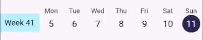

# Weekday Scroller

A weekday picker where you can scroll between weeks.



## Installing

To use this package, add `weekday_scroller` as a dependency in your `pubspec.yaml` file.

## Usage

```dart
WeekdayScroller(
  selectedDay: _selectedDay,
  changeDay: (value) => setState(() {
    _selectedDay = value;
  }),
),
```

## Custom styling
You can use custom colors and labels by the optional parameters:

* `weekdayText` specifies the weekday text: default is 'Week'
* `weekdays` specifies the weekday strings ['Mon', 'Tue'...]
* `backgroundColor`
* `selectedColor` color of the selected day circle
* `selectedTextColor` color of the selected digits text
* `textColor` color of the unselected digits text
* `weekdayColor` is the color of the weekdays 'Mon', 'Tue'...
* `weeknumberColor`
* `weeknumberTextColor`
* `daysInWeek` specifies the number of weekdays to render, default is 5, so Monday to Friday
